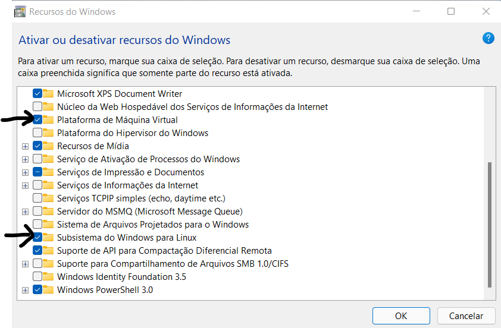
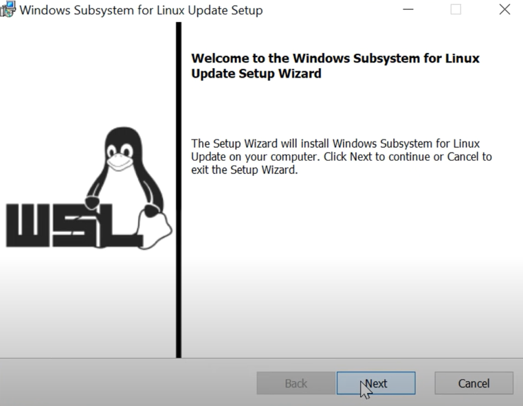
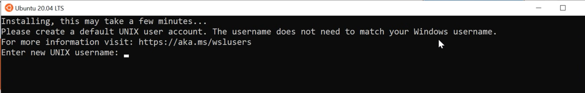
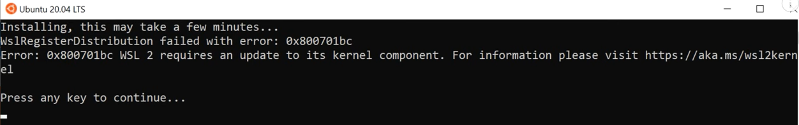
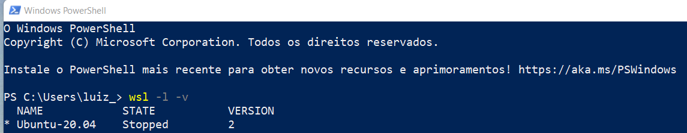

# WSL2 a Good Alternative to Use UNIX Systems
Autor Luiz Carlos  
Date: 30/12/2021


# What is the Windows Subsystem for Linux?

The Windows Subsystem for Linux lets developers run a GNU/Linux environment -- including most 
command-line tools, utilities, and applications -- directly on Windows, unmodified, without the
overhead of a traditional virtual machine or dualboot setup.

WSL 2 is a new version of the Windows Subsystem for Linux architecture that powers the Windows 
Subsystem for Linux to run ELF64 Linux binaries on Windows. Its primary goals are to increase file
system performance, as well as adding full system call compatibility.

## Prerequisites
You must be running Windows 10 version 2004 and higher (Build 19041 and higher) or Windows 11.

To check typy windowns Key + R ans search for

    winver

## Check for updates

    Start > Settings > Windows Update > Check for updates.


# Installation

### For new versions of windows
[link to full tutorial on how to install WSL2](https://docs.microsoft.com/en-us/windows/wsl/install)


## For old versions of windows follow the steps bellow or visit microsoft webpage tutorial
[link to full tutorial on how to install WSL2 in old versions](https://docs.microsoft.com/en-us/windows/wsl/install-manual)


#### Step 1 - Enable features

Go to windows features (Ativar ou desativar recursos do windows - Versão Português) and tick the options:

* Vitual Machine Plataform (Plataforma de Máquina Virtual - Versão Português)
* Windows Subsystem for Linux (Subsistema do Windows para Linux - Versão Português)



#### Steep 2 - Download the Linux kernel update package

[WSL2 Linux kernel update package for x64 machines](https://wslstorestorage.blob.core.windows.net/wslblob/wsl_update_x64.msi)

Run the update package downloaded in the previous step. 
(Double-click to run - you will be prompted for elevated permissions, select ‘yes’ to approve this installation.)



#### Step 3 - Download a linux distro from Windowns store

* Windows recommend Ubuntun
* Launch it
* Create you login and password
* Wait for installation to complete

And there you go, now you have a linux kernel installed in you computer. Feel free to work around.



If you didn't have instal a new kernel first, you will see.


Than go to the URL and install it

#### Step 4 - Set WSL 2 as your default version

Open PowerShell as administrator and run this command to set WSL 2 as the default version of a new Linux distribution:

    wsl --set-default-version 2

#### step 5 - Check if the version 2 of wsl is running

In ther powershell terminal type:

    wsl -l -v

Note: If the linux terminal is off, the command above will show:  state = stopped and version = 2  




### step 6 - rename host name password


My new version of ubuntu don't reconnize my password.
Then I have to change it as root user.
```bash
# on CMD prompt, set root as default 
ubuntu config --default-user root

# on ubuntu prompt, set a new password for the username
passwd username

# on CMD prompt, set user as default again
ubuntu config --default-user username

##### on ubuntu prompt:
# open the file with namo
sudo nano /etc/hostname
# Then change the old hostname for the new hostname

sudo nano /etc/hosts
# Then change the old hosts for the new hosts

# reboot the system
sudo reboot
```


#### 5 Install Windows Terminal (optional - I recommend)

* Using Windows Terminal enables you to open multiple tabs or window panes to display and quickly switch between 
multiple Linux distributions or other command lines (PowerShell, Command Prompt, Azure CLI, etc). 
* You can fully customize your terminal with unique color schemes, font styles, sizes, background images ect.
* And you can open a terminal from wherever you are in you windows file system, and work in linux.


# Reclain space alocated into wsl back to Windowns


''' Ubuntu app with miniconda install and some envs setuped, must use about 20Gb to work.
    Anything besides that, could be some space retained by the WSL, which can be return to 
    windowns with the following steps. '''


## For Windows 10 Home Optimize-VHD cmdlet

The follow command must be run in PowerShell as Administrator user.
```cmd
wsl --shutdown
diskpart
select vdisk file="C:\Users\change_for_your_user_name\AppData\Local\Packages\CanonicalGroupLimited.Ubuntu20.04onWindows_79rhkp1fndgsc\LocalState\ext4.vhdx"
attach vdisk readonly
compact vdisk
detach vdisk

exit
```


## Windowns PRO Optimize (shrink) WSL 2 .vhdx

The following commands must be run in PowerShell as Administrator user.

Find a DistroFolder found at: $env:LOCALAPPDATA\Packages\

Examples:
* CanonicalGroupLimited.UbuntuonWindows_79rhkp1fndgsc
* CanonicalGroupLimited.Ubuntu20.04onWindows_79rhkp1fndgsc

```cmd
cd LOCALAPPDATA\Packages\REPLACE_IT_WITH_TARGET_DISTRO_FOLDERNAME\LocalState\

cd LOCALAPPDATA\Packages\CanonicalGroupLimited.Ubuntu20.04onWindows_79rhkp1fndgsc\LocalState\

wsl --shutdown

optimize-vhd -Path .\ext4.vhdx -Mode full
```


## Run wsl or your favorite terminal


## References and usefull links:
https://docs.microsoft.com/en-us/windows/wsl/about
https://docs.microsoft.com/en-us/windows/wsl/install
https://docs.microsoft.com/en-us/windows/wsl/install-manual

Instalation WSL2 on David Bombal channel:
https://www.youtube.com/watch?v=_fntjriRe48&list=PLzEzeFOP0XCMKBXmNC55hYZOOKZll7vFa&index=4&t=222s&ab_channel=DavidBombal

Reclain disk space on Nick Jane channel:
https://www.youtube.com/watch?v=wSHMFX-4i3g&list=PLzEzeFOP0XCMKBXmNC55hYZOOKZll7vFa&index=3&t=3s&ab_channel=NickJanetakis